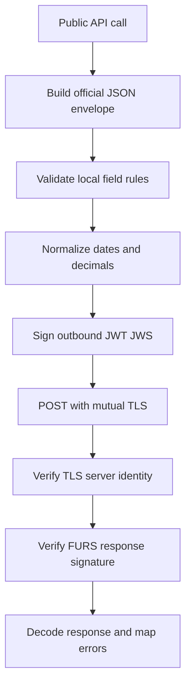

# FURS fiscal audit

## Scope and sources

Official sources checked:

- eDavki technical specifications page: `https://edavki.durs.si/edavkiportal/openportal/CommonPages/Opdynp/PageD.aspx?category=dpr_teh_spec`
- Direct technical documentation PDF: `https://www.datoteke.fu.gov.si/dpr/files/TehnicnaDokumentacijaVer3.2.pdf`

Observed official-document facts:

- The page currently presents Version 3.2 of the technical documentation and recent 2025-2026 notices, including TLS cipher-suite changes for test and production endpoints.
- The PDF is Version 3.2 and contains the request-field tables for `InvoiceRequest`, `BusinessPremiseRequest`, sales-book invoices, certificates, endpoints, and TLS.
- Numeric invoice and tax fields are decimal values with maximum 2 decimal places and field-specific maximum lengths.
- `CustomerVATNumber`, `InvoiceAmount`, `VATTaxableAmount`, `TaxAmount`, and many other request fields have explicit mandatory or conditional requirements.
- Current official endpoint ports remain test `9002` and production `9003`.

## Key code areas reviewed

- Public message builders: `furs_fiscal/api.py`
- Shared send/decode/error flow: `furs_fiscal/base_api.py`
- Certificate handling, JWS signing, endpoints, HTTP transport: `furs_fiscal/connector.py`
- Packaging/runtime dependency declarations: `setup.py`, `requirements.txt`

## High-priority findings

### 1. Server JWT/JWS signature is not verified

Evidence:

- `FURSBaseAPI._send_request()` decodes `response.json()['token']` with signature verification disabled in `furs_fiscal/base_api.py:53`.
- The code itself has a TODO at `furs_fiscal/base_api.py:52`.

Why it matters:

- Official architecture uses signed messages; accepting unsigned or tampered response payloads weakens integrity of `UniqueInvoiceID`, error responses, and other server data.

Recommendation:

- Add trusted FURS response certificate handling and verify response JWT/JWS signatures by default.
- Keep a documented compatibility flag only if needed for migration.

### 2. TLS certificate verification is disabled globally and per request

Evidence:

- `requests.packages.urllib3.disable_warnings()` in `furs_fiscal/connector.py:11`.
- `verify=False` in `Connector.post()` at `furs_fiscal/connector.py:131`.
- `verify=False` in `Connector.send_echo()` at `furs_fiscal/connector.py:152`.

Why it matters:

- Mutual TLS client auth is present, but server identity is not verified by `requests`, which creates MITM risk.
- The official page notes active TLS/cipher-suite updates, so transport configuration should be explicit and testable.

Recommendation:

- Introduce configurable CA bundle verification for test and production FURS certificates.
- Default to verification enabled once trusted CA paths are provided; avoid silent global warning suppression.

### 3. Business-premise `SoftwareSupplier` can be invalid when both supplier inputs are absent

Evidence:

- `_prepare_software_supplier_json()` returns `{'NameForeign': foreign_software_supplier_name}` when `software_supplier_tax_number` is falsy in `furs_fiscal/api.py:145` to `furs_fiscal/api.py:149`.
- `_build_common_message_body()` always includes this item in `SoftwareSupplier` in `furs_fiscal/api.py:161` to `furs_fiscal/api.py:164`.

Why it matters:

- If both supplier fields are omitted, the payload contains `NameForeign: None`, which is likely invalid JSON semantics for the official schema.

Recommendation:

- Validate that exactly one supported software-supplier identity is supplied, or omit/raise according to the official conditional requirement.
- Add tests for Slovenian tax-number supplier and foreign-name supplier cases.

### 4. Decimal serialization and formatting are not controlled

Evidence:

- Invoice/tax amounts are passed directly into JSON payloads in `furs_fiscal/api.py:405`, `furs_fiscal/api.py:406`, `furs_fiscal/api.py:520`, and `furs_fiscal/api.py:521`.
- `TaxesPerSeller.add_vat_amount()` stores raw values in `furs_fiscal/api.py:191` to `furs_fiscal/api.py:198`.
- README explicitly lists Decimal serialization as unsupported work in `README.md:157`.

Why it matters:

- Official fields are decimal values with max 2 decimal places. Python `Decimal` is not JSON serializable by default in `requests.post(json=...)`, while floats can produce representation issues.

Recommendation:

- Add a shared amount normalizer that accepts `Decimal`, `int`, and safe strings, validates max 2 decimals, and serializes deterministically.
- Use it for all monetary fields and tax rates as appropriate.

### 5. Zero-valued optional numeric fields are silently dropped or overwritten

Evidence:

- `TaxesPerSeller.build_json()` checks truthiness for optional amounts in `furs_fiscal/api.py:208` to `furs_fiscal/api.py:215`.
- `get_invoice_eor()` checks truthiness for `returns_amount` and `operator_tax_number` in `furs_fiscal/api.py:341` to `furs_fiscal/api.py:345`.
- `PaymentAmount` falls back to invoice amount when `payment_amount` is falsy in `furs_fiscal/api.py:406` and `furs_fiscal/api.py:521`.

Why it matters:

- Official decimal fields may legitimately be `0` or `0.00` in some edge cases. Truthiness checks corrupt caller intent.

Recommendation:

- Replace truthiness checks with `is not None` for numeric optional fields.
- Preserve backward compatibility carefully and add regression tests for zero values.

### 6. `FlatRateCompensation` is accepted in constructor but never serialized

Evidence:

- `TaxesPerSeller.__init__()` accepts `special_tax_rules_amount` in `furs_fiscal/api.py:180`.
- `build_json()` never emits a corresponding field in `furs_fiscal/api.py:200` to `furs_fiscal/api.py:220`.
- Official table includes flat-rate compensation under the tax-per-seller section.

Why it matters:

- Users cannot submit this supported tax case despite the API parameter implying support.

Recommendation:

- Rename or alias the parameter to match the official concept and serialize it as the official field.
- Keep old parameter as deprecated alias if public compatibility matters.

### 7. Header `DateTime` formatting is inconsistent and timezone-naive

Evidence:

- Business premise header includes `Z` in `furs_fiscal/api.py:139`.
- Invoice header omits `Z` in `furs_fiscal/api.py:386`.
- Both use `datetime.datetime.now()` without timezone awareness.
- Invoice issue date always appends `Z` using the caller's naive or aware datetime without conversion in `furs_fiscal/api.py:398`.

Why it matters:

- `Z` denotes UTC, but the code does not convert to UTC. This can submit local Ljubljana time labelled as UTC.
- Header consistency should follow the official schema exactly.

Recommendation:

- Centralize timestamp formatting.
- If `Z` is required, convert aware datetimes to UTC before formatting; define behavior for naive datetimes explicitly.

### 8. `calculate_zoi()` likely uses incompatible RSA padding for the protected ID calculation

Evidence:

- `calculate_zoi()` signs concatenated content then MD5 hashes the signature in `furs_fiscal/api.py:252` to `furs_fiscal/api.py:256`.
- `_sign()` uses RSA-PSS padding in `furs_fiscal/base_api.py:78` to `furs_fiscal/base_api.py:83`.

Why it matters:

- FURS ZOI/protected-ID algorithms historically require a deterministic RSA signature over the prescribed concatenated string before MD5. RSA-PSS is randomized, so repeated calls for the same invoice data can produce different ZOI values.

Recommendation:

- Verify the exact padding required in Version 3.2 and change protected-ID signing to the official deterministic algorithm if needed.
- Add a test that repeated calls with identical inputs return identical ZOI.

### 9. Sales-book reference date uses unconstrained `isoformat()`

Evidence:

- `ReferenceSalesBookIssueDate` uses `reference_sales_book_issued_date.isoformat()` in `furs_fiscal/api.py:496`.
- Sales-book issue date uses `%Y-%m-%d` in `furs_fiscal/api.py:513`.

Why it matters:

- Official sales-book date fields are date values, not arbitrary Python ISO datetimes with timezone and time components.

Recommendation:

- Format `ReferenceSalesBookIssueDate` with `%Y-%m-%d` if the official schema expects a date.
- Add tests for date-only serialization.

### 10. `ForeignOperator` and `OperatorTaxNumber` validation is incomplete

Evidence:

- `operator_tax_number` is added when truthy in `furs_fiscal/api.py:344` to `furs_fiscal/api.py:345`.
- `ForeignOperator` is added independently when true in `furs_fiscal/api.py:347` to `furs_fiscal/api.py:348`.

Why it matters:

- These fields are semantically mutually dependent in FURS invoice rules: the submitter should not send contradictory domestic and foreign operator data.

Recommendation:

- Validate mutually exclusive combinations and required conditions before sending.

## Medium-priority findings

### 11. Mutable default arguments

Evidence:

- `taxes_per_seller=[]` in `get_invoice_eor()` at `furs_fiscal/api.py:287`.
- `taxes_per_seller=[]` in `get_sales_book_invoice_eor()` at `furs_fiscal/api.py:423`.

Recommendation:

- Change defaults to `None` and initialize inside the method.

### 12. Type checks reject subclasses and iterables

Evidence:

- `type(taxes_per_seller) == TaxesPerSeller` and `type(taxes_per_seller) != list` in `furs_fiscal/api.py:329` to `furs_fiscal/api.py:332` and `furs_fiscal/api.py:463` to `furs_fiscal/api.py:466`.

Recommendation:

- Use `isinstance()` and validate list contents.

### 13. HTTP error handling is too narrow

Evidence:

- `_send_request()` only catches `requests.exceptions.Timeout` in `furs_fiscal/base_api.py:59`.
- Network exceptions, invalid JSON, missing `token`, and JWT decode failures are not normalized.

Recommendation:

- Catch `RequestException`, `ValueError`, `KeyError`, and JWT exceptions into a structured exception hierarchy.

### 14. Temporary certificate/key files are leaked and not permission-hardened

Evidence:

- `NamedTemporaryFile(delete=False)` is used for cert/key files in `furs_fiscal/connector.py:75` and `furs_fiscal/connector.py:79`.
- No cleanup method or context-manager support exists.

Recommendation:

- Add `close()` and context manager support to unlink temp files.
- Restrict private-key temp file permissions where possible.

### 15. `ConnectionException.code` accidentally becomes a tuple

Evidence:

- `self.code = code,` in `furs_fiscal/exceptions.py:30`.

Recommendation:

- Remove the trailing comma and add a unit test.

### 16. Unused import

Evidence:

- `import json` in `furs_fiscal/base_api.py:1` is unused.

Recommendation:

- Remove during cleanup.

## Suggested remediation order

1. Add characterization tests for current payload builders without making network calls.
2. Fix deterministic ZOI signing if Version 3.2 confirms non-PSS signing.
3. Add decimal normalization and zero-value preservation across invoice and tax fields.
4. Fix `FlatRateCompensation` serialization and sales-book reference-date formatting.
5. Add validation for software supplier, foreign/domestic operator, reference invoice list lengths, and tax-per-seller contents.
6. Improve exception handling for network, response JSON, token, and JWT decode failures.
7. Add temporary-file cleanup/context-manager behavior.
8. Add optional verified TLS CA handling and server JWT/JWS verification once trusted certificates are wired in.
9. Update README examples and documentation for timezone/Decimal/certificate behavior.
10. Run targeted pytest tests and package build checks.

## Implementation-ready test cases

- Repeated `calculate_zoi()` calls with identical input return the same result.
- `PaymentAmount=0`, `ReturnsAmount=0`, and tax amount `0` are preserved where valid.
- `Decimal('1.20')` serializes as a JSON-compatible two-decimal numeric/string representation accepted by FURS contract decisions.
- `special_tax_rules_amount` emits the official flat-rate compensation field.
- Missing software-supplier identity raises a clear local validation error.
- Both `operator_tax_number` and `foreign_operator=True` raise a clear local validation error.
- Sales-book reference issue date serializes as `YYYY-MM-DD`.
- `ConnectionException.code` is an integer, not a tuple.
- Temporary certificate/key files are removed after `close()` or context-manager exit.
- Malformed server response without `token` raises a library exception, not raw `KeyError`.

## Mermaid overview

